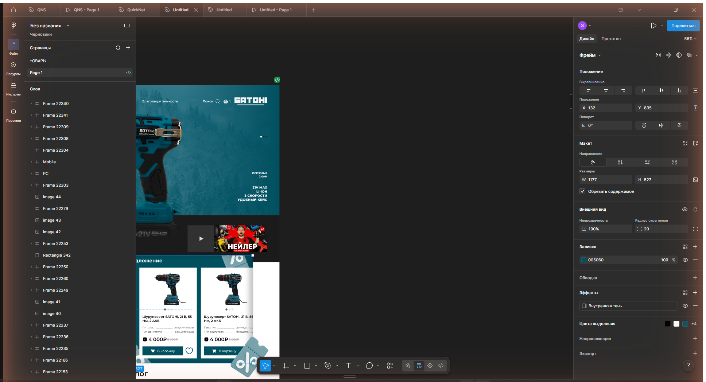
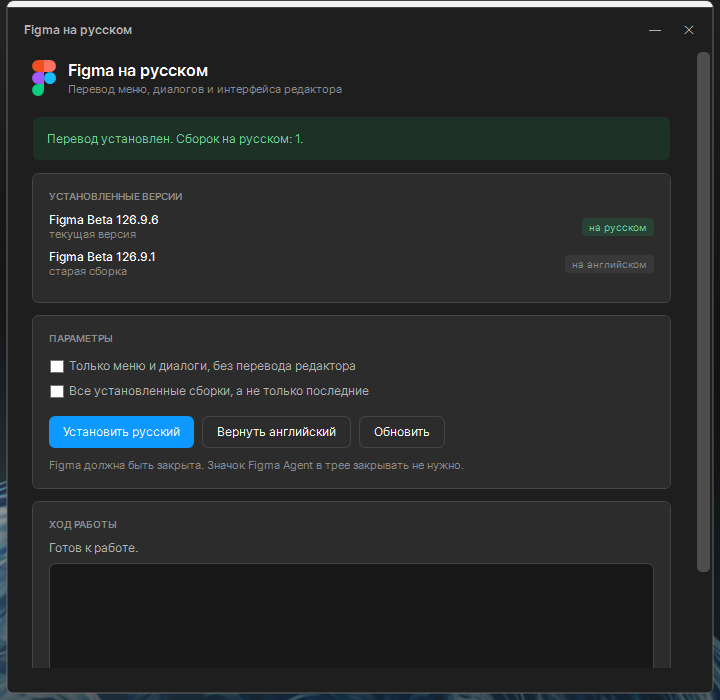

# Figma на русском

Переводит интерфейс десктопной Figma на русский язык: меню, диалоги, панель
свойств, левую панель, тулбар, файловый браузер.

Работает и со **стабильной** Figma, и с **Figma Beta**. Если установлены обе —
переведёт обе.



---

## Установка за три шага

**Шаг 1.** Скачайте файл **FigmaRu-Setup.exe** со страницы
[Releases](../../releases/latest).

**Шаг 2.** Полностью закройте Figma.
Значок **Figma Agent** в трее (у часов) закрывать не нужно — он не мешает.

**Шаг 3.** Запустите скачанный файл двойным кликом и нажмите
**«Установить русский»**.

Всё. Открывайте Figma — она будет на русском.



Больше ничего устанавливать не нужно: это одна программа, внутри уже есть всё
необходимое. Она ничего не скачивает из интернета.

### Если Windows показала предупреждение

Windows не знает эту программу, потому что у неё нет платной подписи
разработчика. Это нормально для небольших бесплатных проектов.

- Если появилось окно **«Windows защитила ваш компьютер»** — нажмите
  **«Подробнее»**, затем **«Выполнить в любом случае»**.
- Если файл не запускается — правый клик по нему → **«Свойства»** → внизу
  галочка **«Разблокировать»** → **ОК**.

### Не запускайте от имени администратора

Figma устанавливается в вашу личную папку, и из-под администратора программа её
не найдёт. Просто двойной клик.

---

## Как вернуть английский

Запустите ту же программу и нажмите **«Вернуть английский»**.

При установке рядом с файлами Figma сохраняется копия оригинала, поэтому откат
не требует переустановки Figma.

## Figma обновилась, и язык снова английский

Так и будет. Figma ставит каждое обновление в новую папку, поэтому перевод после
обновления нужно поставить заново: запустите программу и снова нажмите
**«Установить русский»**. Программа сама заметит, что Figma обновилась, и скажет
об этом.

---

## Что переводится

| Часть Figma | Состояние |
|---|---|
| Меню, подменю, контекстные меню вкладок | переведено полностью |
| Диалоги, панель вкладок, экраны ошибок | переведено полностью |
| Панель свойств, левая панель, тулбар, файловый браузер | переведено по словарю (436 фраз) |
| Ваш дизайн на холсте | не трогается — он вообще недоступен программе |
| Маркетинговые экраны (тарифы), названия плагинов | остаются английскими |

Перевод интерфейса редактора неполный по своей природе: строк в Figma тысячи, и
она меняет их при обновлениях. Непереведённое просто остаётся английским.

**Важно и честно:** имена слоёв и страниц переводятся, если имя **точно**
совпадает с фразой из словаря — например, страница, названная ровно
`Components`, покажется как «Компоненты». Автоматические имена Figma
(`Frame 22340`, `Rectangle 3`) под это не попадают никогда. Эффект только
визуальный: в самом файле ничего не меняется, при откате всё возвращается.
Слова, которые дизайнеры чаще всего используют как имена, вынесены в
`src/web/chrome-only.json` — они переводятся только во всплывающих подсказках.

**Цена перевода.** Размер файла Figma жёстко зафиксирован, поэтому место под
русский язык приходится освобождать: японский словарь удаляется, остальные
сжимаются. Все языки, кроме японского, продолжают работать. Программа каждый раз
пишет в журнале, чем именно пожертвовала.

---

## Что программа делает с компьютером

Чтобы не пришлось верить на слово:

- меняет **только** файл `app.asar` внутри папки Figma
  (`%LOCALAPPDATA%\Figma*\app-*\resources\`);
- рядом кладёт копию оригинала `app.asar.figma-ru-orig` — это и есть кнопка
  «назад»;
- ничего не отправляет в интернет и ничего не скачивает;
- не требует прав администратора;
- не запускается сама и нигде не прописывается в автозагрузку.

Новый файл сначала собирается целиком и проверяется, и только если проверка
прошла — заменяет рабочий. Если что-то пошло не так, Figma остаётся нетронутой.

---

## Не нашли ответа

- **Программа пишет «Figma не найдена».** Скорее всего, она запущена от имени
  администратора — закройте и откройте обычным двойным кликом.
- **Программа пишет «Figma запущена».** Закройте окно Figma. Если окна не видно:
  Ctrl+Shift+Esc → найдите Figma → «Снять задачу».
- **Figma не открывается после установки.** Запустите программу и нажмите
  «Вернуть английский». Если и это не помогло — переустановите Figma, ваши файлы
  хранятся в облаке и не пострадают.

---

## Для разработчиков

Устройство патча, три ограничения Figma, которые его определяют, и как собрать
`.exe` — в [docs/ARCHITECTURE.md](docs/ARCHITECTURE.md).

Коротко:

```powershell
.\build.ps1          # собрать dist\Figma на русском.exe (нужен Node.js и Windows)
```

```bash
node install.js --dry-run    # то же самое из командной строки, без изменений
node uninstall.js            # откат
node tools/validate-i18n.js  # проверка словаря оболочки
```

Словари: `src/i18n/ru.json` (оболочка, 328 строк) и `src/web/phrases.json`
(редактор, 436 фраз). Пул-реквесты с дополнениями приветствуются.
